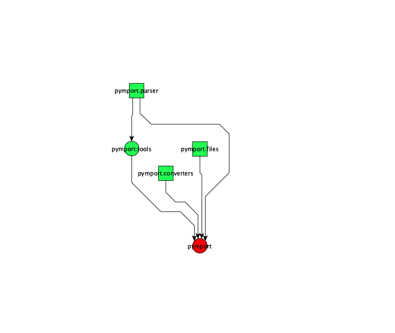
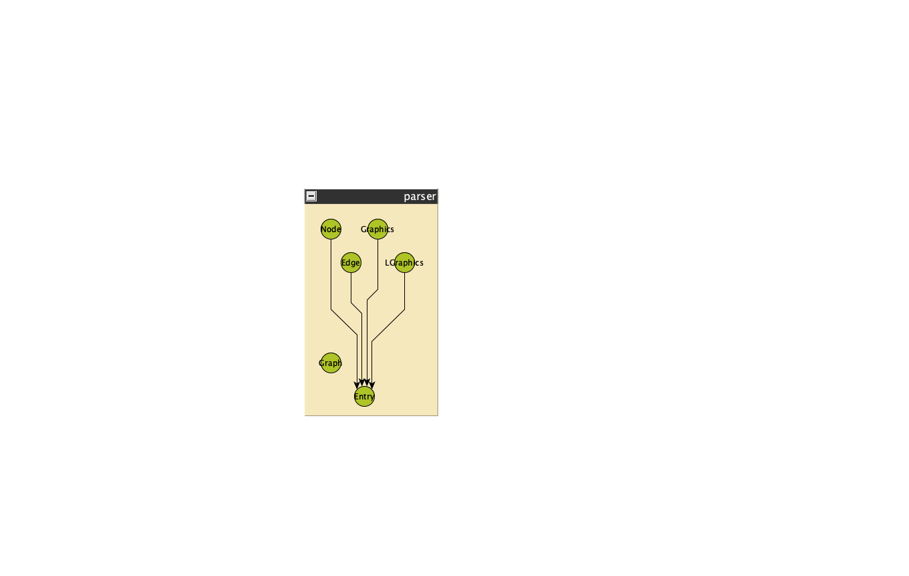

# PyLibScheme

Инструмент для рисования графа по файлам библиотеки python. Использует инструменты анализа кода `pydeps` и `pyreverse` для генерации графов и `gv2gml` для преобразования выходного `.dot` файла в удобный для просмотра `.gml` файл. Предполагается использование бесплатного редактора [yEd](https://www.yworks.com/products/yed) или [yEd live](https://www.yworks.com/yed-live/?ref=hackernoon.com).

## Использование

Строит граф только по указанной библиотеке. Создает 2 файла:

- `*_cls.gml` - граф классов
- `*_pkg.gml` - граф импортов

> **ОСТОРОЖНО:** во избежание включения в структуру внешних библиотек, рекомендуется устанавливать инструмент в отдельную python среду и вызывать функцию анализа из нее!

**Граф импортов**

Создает граф импортов python библиотеки. Корректно работает даже для пространств имен (пакетов без `__init__.py`). Выстраивает иерархию модулей с помощью групп на графе. Указывается путь до папки библиотеки:

```
import pylibscheme

gml = pylibscheme.create_import_graph('path/to/lib/lib_folder')
```



**Граф классов**

Создает граф классов python библиотеки. Корректно работает даже для пространств имен (пакетов без `__init__.py`). Указывает адреса классов (пути до файлов) с помощью групп на графе. Указывается путь до папки библиотеки:

```
import pylibscheme

gml = pylibscheme.create_class_graph('path/to/lib/lib_folder')
```



## Установка

**Poetry**:

```
poetry install
```

**Conda/mamba**:

```
conda install -f environment.yaml
```

## Планы на будущее

- Добавление выполнения из командной строки (Argparser)
- Добавление информации на граф (выходы методы у классов в виде названий соединений, аннотации в сигнатурах методов)
- Добавление поддержки аннотаций, pydantic и др библиотек, если они отображаются некорректно
- Оптимизация алгоритмов обхода графа и ускорение выполнения
